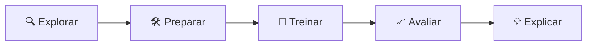

# 💳 Detecção de Fraude em Cartão de Crédito

Projeto de Machine Learning para identificar transações fraudulentas em um dataset real e extremamente desbalanceado (0,17% de fraude), com comparação de modelos, ajuste de limiar de decisão e explicabilidade via SHAP.


---

## 📌 Sumário

- [O problema](#-o-problema)
- [Dataset](#-dataset)
- [Metodologia](#-metodologia)
- [Preparação dos dados](#-preparação-dos-dados)
- [Comparação dos modelos](#-comparação-dos-modelos)
- [Limiar de decisão](#-limiar-de-decisão)
- [Curva ROC](#-curva-roc)
- [Explicabilidade (SHAP)](#-explicabilidade-shap)
- [Diferenças em relação ao roteiro base](#-diferenças-em-relação-ao-roteiro-base)
- [Como executar](#-como-executar)
- [Estrutura do repositório](#-estrutura-do-repositório)
- [Autor](#-autor)

---

## 🎯 O problema

O dataset contém **284.807 transações** de cartão de crédito, das quais apenas **492 (0,17%)** são fraudulentas.

Esse desbalanceamento extremo torna a **acurácia uma métrica enganosa**: um modelo que simplesmente prevê "não é fraude" para todas as transações já acertaria **99,83%** das vezes — e ainda assim seria completamente inútil na prática.

Por isso, a avaliação deste projeto foca em métricas que realmente importam para a classe minoritária:

| Métrica | O que mede |
|---|---|
| **Recall** | Quantas fraudes reais o modelo conseguiu detectar |
| **Precisão** | Quantos alarmes de fraude eram realmente fraude |
| **F1-score** | Equilíbrio entre as duas métricas acima |

---

## 📊 Dataset

- **Fonte:** [Credit Card Fraud Detection](https://www.kaggle.com/datasets/mlg-ulb/creditcardfraud) (Kaggle, ULB)
- **Colunas:** `Time`, `Amount`, `Class` (alvo: 0 = normal, 1 = fraude), e `V1` a `V28` (variáveis anonimizadas via PCA para preservar a privacidade dos titulares)
- O dataset **não está incluído neste repositório** — ele é baixado automaticamente pelo notebook via API do Kaggle.

---

## 🔬 Metodologia

O projeto segue cinco etapas:



1. **Explorar** — carregamento com pandas, checagem de nulos e medição do desbalanceamento
2. **Preparar** — engenharia de variáveis, padronização e divisão treino/teste estratificada
3. **Treinar** — regressão logística (baseline), Random Forest e XGBoost, com peso de classe
4. **Avaliar** — relatório de classificação, curva ROC, curva precisão-recall e ajuste de limiar
5. **Explicar** — importância de variáveis com SHAP

---

## 🛠 Preparação dos dados

- **Valores nulos:** nenhum encontrado na base.
- **`Amount_log`:** aplicado `log1p` sobre `Amount` para corrigir a forte assimetria da distribuição original (poucas transações de valor muito alto distorciam a escala).
- **Padronização:** `StandardScaler` aplicado a `Time` e `Amount_log`, colocando-as na mesma escala das variáveis `V1`-`V28` (já padronizadas pelo PCA original).
- **Split treino/teste:** 80/20 com `stratify=y`, garantindo a mesma proporção de 0,17% de fraude em ambos os conjuntos.

---

## 🤖 Comparação dos modelos

Avaliação no conjunto de teste, limiar padrão (0.5), métricas da classe **Fraude**:

| Modelo | Precisão | Recall | F1-score |
|---|:---:|:---:|:---:|
| Regressão Logística (baseline) | 0.06 | **0.92** | 0.11 |
| Random Forest | **0.96** | 0.73 | 0.83 |
| **XGBoost** ⭐ | 0.89 | 0.83 | **0.86** |

**Leitura dos resultados:**
- A regressão logística, com `class_weight="balanced"`, prioriza recall ao extremo — pega quase todas as fraudes, mas gera muitos falsos alarmes (baixa precisão).
- O Random Forest inverte a lógica: quase nenhum falso positivo, porém deixa mais fraudes passarem.
- O **XGBoost** entrega o melhor equilíbrio entre as duas métricas, sendo escolhido como modelo final.

---

## 🎚 Limiar de decisão

Usando a curva de precisão-recall sobre as probabilidades do XGBoost, foi calculado o limiar que maximiza o F1-score:

| Métrica | Limiar padrão (0.5) | Limiar ajustado (**0.964**) |
|---|:---:|:---:|
| Precisão | 0.89 | **0.95** |
| Recall | 0.83 | 0.81 |
| F1-score | 0.86 | **0.87** |

O ajuste reduz significativamente os falsos positivos, com custo pequeno em recall — um trade-off razoável para reduzir alarmes desnecessários em um cenário real de investigação de fraude.

---

## 📈 Curva ROC

O modelo XGBoost atingiu **AUC-ROC = 0.969**, indicando forte capacidade de separar transações fraudulentas de normais, independentemente do limiar escolhido (1.0 seria a separação perfeita; 0.5, um chute aleatório).

---

## 💡 Explicabilidade (SHAP)

A análise com `SHAP TreeExplainer` mostrou que as variáveis mais influentes nas decisões do modelo são **V14**, **V4**, **V12** e **V10** — todas resultantes da transformação PCA original:

- Valores **baixos de V14** empurram fortemente a previsão em direção a "fraude".
- Valores **altos de V4** também aumentam a probabilidade prevista de fraude.
- `Amount_scaled` e `Time_scaled`, embora usadas no modelo, têm impacto bem menor que essas variáveis anônimas — ou seja, o padrão oculto capturado pelo PCA pesa mais que o valor ou o momento da transação.

---

## 🔄 Diferenças em relação ao roteiro base

- Comparação de **três modelos** (regressão logística, Random Forest, XGBoost), em vez de avaliar apenas um baseline.
- Modelo final escolhido pelo **melhor F1** na classe fraude, não pela acurácia geral.
- **Ajuste de limiar de decisão** feito diretamente sobre a curva de precisão-recall do XGBoost, maximizando o F1 em vez de usar o corte padrão de 0.5.

---

## ▶️ Como executar

1. Abra o notebook `deteccao_fraude.ipynb` no [Google Colab](https://colab.research.google.com/).
2. Gere um token de API em [kaggle.com/settings/api](https://www.kaggle.com/settings/api) e guarde-o nos **Secrets** do Colab com o nome `KAGGLE_KEY`.
3. Execute as células em ordem (`Ambiente de execução → Executar tudo`) — o dataset é baixado automaticamente pela API do Kaggle na primeira célula.

---

## 📁 Estrutura do repositório

```
├── deteccao_fraude.ipynb   # Notebook completo com todas as etapas e saídas
└── README.md               # Este arquivo
```

---

## 👤 Autor

**Arthur Ricardo**
Estudante de Análise e Desenvolvimento de Sistemas (IFRO) | Análise de Dados

[](https://github.com/Tp1Arthur)
[](https://www.linkedin.com/in/arthur-ricardo-silva)
